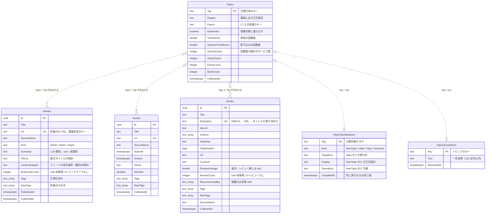

# データベース定義

PostgreSQL のテーブル定義と、テーブル間の関係をまとめた文書。**マイグレーションを 16 個
たどらなくても最終形が分かるようにするため**に置いている。

定義の**権威は3か所**にあり、この文書はそれを読める形に写したもの:

| 何 | どこ |
|---|---|
| 列そのもの(C# のプロパティ) | [`src/TechAntenna.Core/`](../src/TechAntenna.Core/) のモデル |
| 主キー・必須・型変換・索引 | [`TechAntennaDbContext.OnModelCreating`](../src/TechAntenna.Infrastructure/Persistence/TechAntennaDbContext.cs) |
| 実際に当たる DDL | [`src/TechAntenna.Infrastructure/Migrations/`](../src/TechAntenna.Infrastructure/Migrations/) |

**DB に変更を入れたら、同じコミットでこの文書も更新する**(手順は末尾)。

## 全体像



**外部キーは1つも張っていない**(点線はそのため)。タグは `text[]` の中の文字列と突き合わせる
緩い対応で、正規化の規則を変えると対応先が変わる。参照整合性を DB に持たせると、
再正規化のたびに整合を取り直す仕組みが要るので、**アプリ側の突き合わせにとどめている**。

## 横断的な決めごと

- **日時はすべて `timestamp with time zone`(UTC で保存)**。画面に出すときだけローカルへ直す
- **`Tags` / `RawTags` / `Authors` / `RecommendedBy` は `text[]`**。C# の
  `IReadOnlyList<string>` と値変換でつないでいる。**この変換のせいで LINQ から翻訳できず、
  タグごとの件数集計だけ生 SQL**(PostgreSQL の `unnest`)で書いてある
- **`Tags` は正規化済み、`RawTags` は収集元のまま。** 規則を変えたときに過去データを作り直せる
  ように両方持つ(`RawTags` から `Tags` を再生成する)
- **列挙は数値ではなく名前で保存**(`Articles.Kind`・`TopicClassifications.Kind`)。
  `psql` で覗いたときに読めるほうを優先した
- **`null` と `0` は別物**。`BookmarkCount` / `ReviewCount` の `null` は「取得していない」、
  `0` は「ブックマーク・レビューが無い」。混ぜると未取得の行が最下位に沈む
- **重複判定のキーは列にしてユニーク索引を張る**(`Articles.Url` / `Events.Url` /
  `Books.DedupKey`)。ISBN が無い本もあるので、書籍は ISBN13 → URL → タイトルの順で決めた値を持つ

### 索引

| テーブル | 索引 | 何のため |
|---|---|---|
| Articles | `Url`(ユニーク) | 重複取り込みの防止 |
| Articles | `Kind` | 種別ごとの一覧(ニュース / 記事 / 論文) |
| Events | `Url`(ユニーク) | 重複取り込みの防止 |
| Events | `StartsAt` | 開催日順の一覧 |
| Books | `DedupKey`(ユニーク) | 重複取り込みの防止 |
| Topics | `IsSelected` | 収集キーワードの取得 |
| Topics | `CollectedAt` | 更新日時での並び |

## トピックまわりの3テーブルの関係

**トピックに「状態」の列は無い。** 画面に出る区分は、3つの保存先の組み合わせから導出している
(語彙の権威は `src/TechAntenna.Web/topic-catalog.json` + `TopicClassifications`)。

| 画面の区分 | 導出 |
|---|---|
| ツリーに入っている | カタログに**正式表記として**載っている、または `IsSelected` |
| 次の再編成で LLM に聞く語 | 上に入っていない語のうち、タグ 3 回以上 または 話題度あり |
| まだ分類していない | `Topics` に行はあるが、カタログにも `TopicClassifications` にも無い |
| LLM が判断できなかった | `Kind = Unknown`(`ClassifiedAt` から 7 日で未分類に戻る) |
| 技術用語でないと判定された | `Kind = Skip`。**`Topics` の行は削除される**ので分類記録から拾う |
| 別名に吸収された | `Kind = Alias`(行は残るが正式表記ではない) |

- `TopicDescriptions` は**LLM が付けた説明だけ**。人が書いた説明は `topic-catalog.json` にあり、
  同じキーなら JSON を優先する
- `TopicClassifications.ClassifiedAt` は**同じ実行の分が同じ値**になる。これを使って
  「前回の再編成で聞いた語」を復元している(アプリを再起動しても分かるように)
- `Topics` の行は**再編成が消す**ことがある: `Skip` と確定した語、いまの正規化では作られない
  キー(`#生成ai` や `生成ai,`)、表示名が空の古い行。**`IsSelected` の行は消さない**
  —— 消すと収集キーワードごと失われる

## 変更手順

1. `src/TechAntenna.Core/` のモデルを直す(必要なら `TechAntennaDbContext` の設定も)
2. マイグレーションを作る
   ```
   dotnet ef migrations add <名前> -p src/TechAntenna.Infrastructure -s src/TechAntenna.Web
   ```
3. **この文書を同じコミットで更新する**(列の追加・削除・意味の変更・索引・重複キーの変更)
4. 起動時に自動適用される(`Program.cs`)。現物を確かめるなら
   `docker compose exec db psql -U techantenna -d techantenna -c '\d+ "Topics"'`

`TechAntennaDbContextModelSnapshot.cs` は差分計算のために EF が管理するファイルなので手で触らない。
**接続文字列を渡さない起動では EF を通らず**、`src/TechAntenna.Infrastructure/Storage/` の
メモリ実装が使われる(テストが触るのもこちらなので、`dotnet test` に DB は要らない)。
