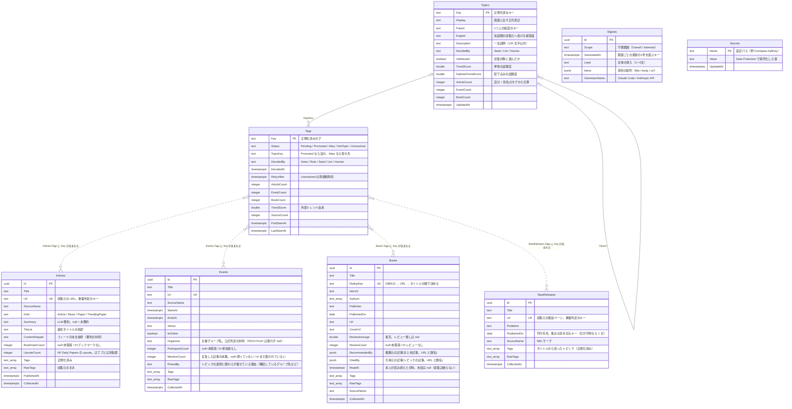
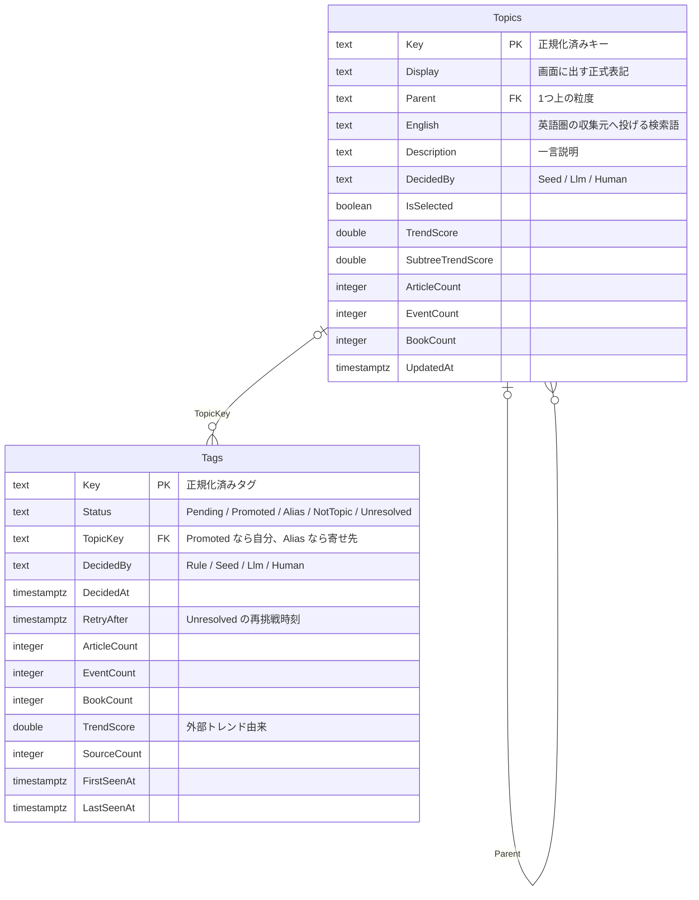

# データベース定義

PostgreSQL のテーブル定義と、テーブル間の関係をまとめた文書。**マイグレーションを
たどらなくても最終形が分かるようにするため**に置いている。

定義の**権威は3か所**にあり、この文書はそれを読める形に写したもの:

| 何 | どこ |
|---|---|
| 列そのもの(C# のプロパティ) | [`src/TechAntenna.Core/`](../src/TechAntenna.Core/) のモデル |
| 主キー・必須・型変換・索引 | [`TechAntennaDbContext.OnModelCreating`](../src/TechAntenna.Infrastructure/Persistence/TechAntennaDbContext.cs) |
| 実際に当たる DDL | [`src/TechAntenna.Infrastructure/Migrations/`](../src/TechAntenna.Infrastructure/Migrations/) |

**DB に変更を入れたら、同じコミットでこの文書も更新する**(手順は末尾)。

## 全体像



`Secrets` は画面から設定した API キー・トークンと、**キー以外でも画面から設定する数少ないもの**
(定期実行の時刻・ジョブのチェック、公式イベントの主催者名簿 `Events:OfficialOrganizers`、
購読するグループの名簿 `Events:FollowedGroups`)。
**どのテーブルとも関係を持たない**。`Name` は設定パスの形(例 `Connpass:ApiKey`)。
**これらの設定の入口はこのテーブル(= 画面)だけ**で、環境変数では渡せない。`Value` は Web 層が Data Protection(鍵は `DataProtection__KeysDirectory`)
で暗号化した文字列 —— **平文は DB に入らない**ので、DB のバックアップだけを持ち出しても
キーは読めない。裏返しに、**鍵ディレクトリを失うと値は戻せない**(アプリは復号できない行を
「未設定」として扱い、画面から入れ直してもらう。行は消さない —— 鍵を戻せば読める可能性を残す)。

`NewReleases` は**最近出た本の観測**(トレンドの「本になっているテーマ」の材料)。
**`Books` と分けてある** —— あちらは「読んでおくべき本」で、レビュー・推薦・書影を伴って
一覧に並べるもの。こちらは<b>読ませるためではなく数えるため</b>に集めるので、持つのは
タイトル・出版者・刊行日とタグだけ。混ぜると書籍の一覧が新刊で埋まる(読み込みの窓を
新刊が食う)。**同じ窓(直近 N か月)を毎回引き直して上書きする**表なので、
既存行は書誌もタグも上書きする(記事・イベント・書籍の「既存は上書きしない」とは方針が逆)——
そのぶん、正規化の規則や語彙を変えても次の収集で揃い、再正規化のジョブを持たなくてよい。

`Digests` はホームの「今日のサマリー」の生成履歴。**どのテーブルとも関係を持たない**
(生成時点の記事・イベントから LLM が書いた文章のスナップショットで、元データが
消えても読み返せることに意味がある)。`Items` を行に分けず `jsonb` 1 列で持つのは、
項目単体を検索・集計する予定が無く、常にダイジェスト丸ごとで読み書きするため。
**1回の生成で `Scope` の違う2行**(技術界隈全体 / 興味トピック)が入り、画面に出すのは
**範囲ごとに `GeneratedAt` が最新の1行**(索引も `Scope, GeneratedAt` の複合)。
`Scope` は数値ではなく名前で持つ(記事の種別と同じ流儀)。
**2本に分ける前の行は `Overall` として残る**(`AddDigestScope` の既定値)。

**外部キーは1つも張っていない**(点線はそのため)。タグは `text[]` の中の文字列と突き合わせる
緩い対応で、正規化の規則を変えると対応先が変わる。参照整合性を DB に持たせると、
再正規化のたびに整合を取り直す仕組みが要るので、**アプリ側の突き合わせにとどめている**。

## 横断的な決めごと

- **日時はすべて `timestamp with time zone`(UTC で保存)**。人に見せるときだけ
  日本時間へ直す(`JapanTime`。実行環境の TZ には依存させない。CLAUDE.md「日時の表示」)。
  **UTC へそろえるのは `TechAntennaDbContext` の値変換1か所**(`DateTimeOffset` の
  プロパティ全部に掛かる)—— Npgsql は `timestamptz` に時差 0 以外の `DateTimeOffset` を
  書けず、収集元は `+09:00` のまま返してくるので、収集元ごとに直して回ると
  書き忘れた1つが「その収集元だけ保存されない」になる
- **`Tags` / `RawTags` / `Authors` は `text[]`**。C# の
  `IReadOnlyList<string>` と値変換でつないでいる。**この変換のせいで LINQ から翻訳できず、
  タグごとの件数集計だけ生 SQL**(PostgreSQL の `unnest`)で書いてある
- **`Books.RecommendedBy` / `Books.CitedBy` は `jsonb`**(`Digests.Items` と同じ流儀)。
  URL と題名の 2 値を 1 件として持つため、`text[]` から移した
  (`ChangeBookRecommendedByToArticles`)。
  **移行では既存の URL を `{"Url": …, "Title": null}` へ写す** —— 800 冊規模で溜まっており、
  捨てると次の「定番の収集」まで画面から推薦が消える。`ALTER ... USING` にサブクエリは
  書けない(PostgreSQL)ので、`to_jsonb` で写してから `UPDATE` で組み替える 2 段にしてある。
  出典単体で検索・集計する予定は無く、常に本を丸ごと読み書きするので行に正規化していない
- **推薦(`RecommendedBy`)と引用(`CitedBy`)は別の列**(`AddBookCitedBy`)。どちらも
  「記事1本がその本を名指しした」という同じ形だが、母集団が違う —— 推薦は「読むべき技術書」を
  挙げた**まとめ記事**(定番の軸。トピックの選択に依存しない)、引用は**選んだトピックについて
  書かれた記事**が本文で挙げたもの(興味トピックの軸)。並べ替えでは 1 票ずつ合算するが
  (`BookPopularity.Endorsements`)、混ぜて保存すると出どころを後から分けられない
  (`BookmarkCount` と `UpvoteCount` を分けているのと同じ理由)。
  **列を足す移行の既定値は `'[]'`** —— EF が生成する空文字は `jsonb` として不正で、
  既存行のある DB ではマイグレーションごと落ちる
- **`Tags` は正規化済み、`RawTags` は収集元のまま。** 規則を変えたときに過去データを作り直せる
  ように両方持つ(`RawTags` から `Tags` を再生成する)
- **列挙は数値ではなく名前で保存**(`Articles.Kind`・`Tags.Status`・`Tags.DecidedBy`)。
  `psql` で覗いたときに読めるほうを優先した
- **`null` と `0` は別物**。`BookmarkCount` / `UpvoteCount` / `ReviewCount` /
  `ParticipantCount` / `MentionCount` の `null` は「取得していない」、`0` は「ブックマーク・
  upvote・レビュー・参加者・言及が無い」。混ぜると未取得の行が最下位に沈む
- **収集で上書きするのは「後から増える数」だけ。** 既存行の書誌にあたる情報は上書きせず、
  `Events` は主催者・参加者数・`PickedBy`、`Books` はレビューだけを取り込む(取れなかった回に
  `null` で上書きもしない)。`Events.MentionCount` は収集とは別に、収集の最後で
  手元の記事と突き合わせて数え直す(外部は叩かない)
- **`Books.ReadAt` だけは収集が一切触らない列**。外から取れる指標(`ReviewCount` /
  `RecommendedBy` / `CitedBy`)が「世の中でどれだけ読まれ、薦められているか」なのに対し、これは
  **本人しか持てない記録**で、画面の「読んだ」からだけ書き換わる
  (`IBookStore.ToggleReadAsync`)。合流(`BookMerge`)が写すと、収集元の本は常に
  `null` なので**再収集のたびに印が消える**。真偽値ではなく日時にしてあるのは、
  いつ読んだかを画面に出せるようにするため
- **人気の指標は収集元ごとに列を分ける**(`BookmarkCount` = はてブ、`UpvoteCount` = HF の
  upvote)。母集団が違うものを 1 列に混ぜると、2 つの意味が 1 つの数字に潰れる
- **重複判定のキーは列にしてユニーク索引を張る**(`Articles.Url` / `Events.Url` /
  `Books.DedupKey`)。ISBN が無い本もあるので、書籍は ISBN13 → URL → タイトルの順で決めた値を持つ

### 索引

| テーブル | 索引 | 何のため |
|---|---|---|
| Articles | `Url`(ユニーク) | 重複取り込みの防止 |
| Articles | `Kind` | 種別ごとの一覧(ニュース / 記事 / 論文) |
| Events | `Url`(ユニーク) | 重複取り込みの防止 |
| Events | `StartsAt` | 開催日順の一覧 |
| Books | `DedupKey`(ユニーク) | 重複取り込みの防止 |
| NewReleases | `Url`(ユニーク) | 重複取り込みの防止 |
| NewReleases | `PublishedOn` | 「直近 N か月」で切った集計 |
| Topics | `IsSelected` | 収集キーワードの取得 |
| Topics | `Parent` | ツリーの組み立て |
| Tags | `Status` + `RetryAfter` | 「次に聞く語」の抽出 |
| Tags | `TopicKey` | 語彙への合算 |
| Digests | `GeneratedAt` | 最新の1件の取得 |

`Secrets` は主キー(`Name`)だけで足りる(数件しか入らない)。

## タグ層(Tags)と語彙(Topics)

**「見かけたタグ」と「語彙」は別物なので、テーブルを分けている。** 以前は `Topics` 一枚に
同居していて(語彙 355 行 + タグ 1400 行)、状態を列にできず、画面の区分を
「行の有無 × カタログに載っているか × 分類記録の種別」から導出していた。
分けたことで **3 テーブル(`Topics` / `TopicClassifications` / `TopicDescriptions`)が
2 テーブル**になった。



**役割:** `Tags` は「見かけた語とその処理状況」、`Topics` は「語彙」。
収集データ(`Articles` / `Events` / `Books`)のタグは<b>まず `Tags` に入る</b>。

### 状態(`Tags.Status`)

| Status | 意味 | 次にどうなるか |
|---|---|---|
| `Pending` | まだ仕分けていない | **全部が次の仕分けの対象**(件数での足切りはしない) |
| `Promoted` | トピックとして精査済み | `Topics` に行があり、`TopicKey` は自分 |
| `Alias` | 別名として既存トピックに吸収 | 件数は `TopicKey` のトピックへ合算 |
| `NotTopic` | トピックとして扱わない(画面の見出しは「除外」) | 語彙に入れず、LLM にも聞き直さない |
| `Unresolved` | LLM が判断できなかった | `RetryAfter` を過ぎたら聞き直す。**ただし件数 0(紐づくデータなし)の行は聞き直さない** |

- **`RetryAfter` を列に持つ**のが要点。「7 日」の計算が読む側から消え、
  「次に聞く語」が `Status = Pending or (RetryAfter <= now かつ件数 > 0)` の条件で引ける
  (`EfTagStore.PendingQuery`)。**件数の条件を保留にだけ掛ける**のは、判断できなかった
  うえに記事・イベント・書籍のどれにも付いていない語は、聞き直しても答えが変わる材料が
  無いため。データが付けば件数が戻り、そのときから対象に復帰する
- **`DecidedBy`** は出どころ(規則で寄せた / シード / LLM / 人が直した)。
  画面で「この別名は LLM が付けた」を出しているので、これを列で持つ
- **状態を書き換えるのはタグの仕分けと手直しの操作だけ。** 観測(件数・話題度の書き込み)は
  状態に触らない —— 収集のたびに仕分けが巻き戻ると、同じ語を何度も LLM に聞くことになる
- **仕分けは「すでに観測したタグ」を対象にする。** 仕分けのジョブは外部トレンドを
  引かないので、**押しても対象は増えない**(押すぶんだけ減る)—— 新しい語が入るのは
  収集と「話題度を取り直す」のとき。画面の「次の仕分けで LLM に聞く語」と一致する

### 語彙の権威は DB に置く(`topic-seed.json` はシード)

`topic-seed.json` は**人が確定させた語彙ではなく、AI に作らせた初期値**なので、
**DB が空のときに一度流し込むシード**として扱う(`DecidedBy = Seed`)。以後の権威は DB 側で、
JSON との衝突ルールは持たない。手直しは画面から状態を書き換える(`DecidedBy = Human`)。

シードを完全に無くすには、次の 2 つが要る(入れば JSON は削除できる):

- ~~英語表記を LLM に出させる~~ —— **済み**。`Topics.English` に持ち、分類の応答に
  相乗りさせている(呼び出しは増えない)。arXiv には英語の検索語が要る
- ~~同義の親を寄せる統合パス~~ —— **済み**(`ITopicMergeAdvisor`)。仕分けの中で語彙の重複を
  LLM に見つけさせ、寄せ元のタグ・配下の親・行の削除まで面倒を見る(`TopicMerger`)
- ~~手直しの経路~~ —— **済み**。`/settings/tags` から状態を書き換えられる(`DecidedBy = Human`)

**残っているのは JSON を実際に外すかの判断だけ。** 空から始めると語彙が育つまで数回の
仕分けが要るので、初期値として置いておくか、捨てて統合パスに任せるかは運用の好みで決められる。

### 何が単純になるか

- 画面の 4 バケツが `GROUP BY Status`(いまは 3 テーブルの突き合わせ)
- 「次に聞く語」が 1 つの条件式(いまは候補の導出 + 期限の計算)
- **別名の件数が寄せ先に合算されるのが構造で保証される**(いまは再正規化の副作用)
- `IsSelected` がトピック側だけに付く(いまは生タグも選択できてしまい、掃除から守る必要がある)
- 呼び方が決まる: `Tags.Key` / `Topics.Key`、跨ぐ参照は `TopicKey`
  (いまは `Topics.Tag` と `TopicDescriptions.Key` が同じ意味で名前が違う)

### マイグレーションの履歴について

**本格稼働の前に履歴を 1 本(`InitialCreate`)にまとめてある。** タグ層を入れるまでに
16 個積み上がっていて、最終形を読むのに全部たどる必要があったため。既存の DB は捨てて
作り直した(まだ本番運用に入っていない時点だったので、移行は書き捨てた)。

以後は積み上げる。**列を足したら、この文書も同じコミットで更新する。**

## 変更手順

1. `src/TechAntenna.Core/` のモデルを直す(必要なら `TechAntennaDbContext` の設定も)
2. マイグレーションを作る
   ```
   dotnet ef migrations add <名前> -p src/TechAntenna.Infrastructure -s src/TechAntenna.Web
   ```
3. **この文書を同じコミットで更新する**(列の追加・削除・意味の変更・索引・重複キーの変更)
4. 起動時に自動適用される(`Program.cs`)。現物を確かめるなら
   `docker compose exec db psql -U techantenna -d techantenna -c '\d+ "Topics"'`

`TechAntennaDbContextModelSnapshot.cs` は差分計算のために EF が管理するファイルなので手で触らない。
**接続文字列を渡さない起動では EF を通らず**、`src/TechAntenna.Infrastructure/Storage/` の
メモリ実装が使われる(テストが触るのもこちらなので、`dotnet test` に DB は要らない)。
